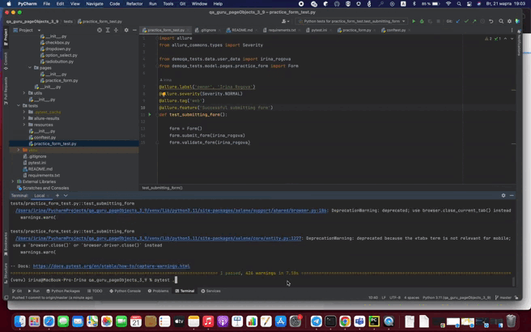

## Проект UI автотестов demoqa.com

<!-- Технологии -->

### Используемые технологии
<p  align="center">
  <code></code>
  <code></code>
  <code></code>
  <code></code>
  <code></code>
  <code></code>
</p>

### Что выполняет тест:
- [x] Заполняет данные формы
- [x] Отправляет заполненные данные
- [x] Проверяет правильность заполненных данных

### Allure results
После прохождения теста можно посмотреть allure отчет, для этого в терминале нужно выполнить следующую команду

``` allure serve tests/allure-results/ ```


##### Видео прохождения теста
